# Inventory App 


# Pour lancer l’application en local avec Docker

## 1. Construire l’image Docker

```bash
docker build -t jeremsdev/inventory-app:v1.0 .
```

Exemple :

```bash
docker build -t jeremsdev/inventory-app:v1.0 .
```
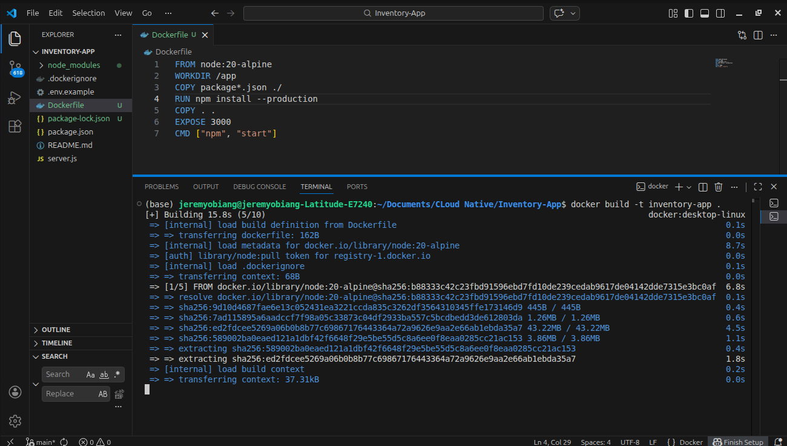


## 2. Lancer le conteneur

```bash
docker run -p 3000:3000 jeremsdev/inventory-app:v1.0
```

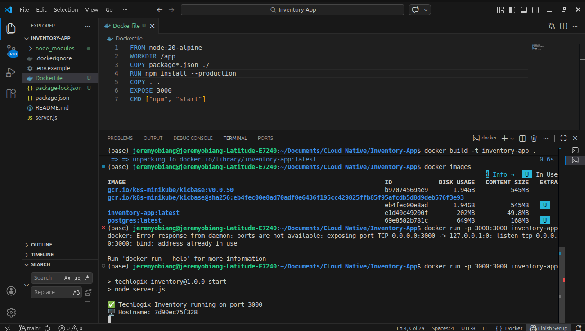


## 3. Accéder à l’application

Ouvrir dans un navigateur :

```
http://localhost:3000
```
```

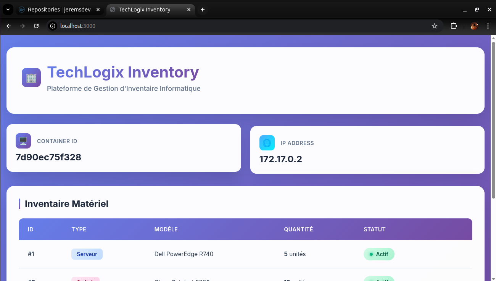

---

# Pour la Pipeline CI/CD (GitHub Actions)

On utilise **GitHub Actions** pour automatiser le build et le push de l’image Docker à chaque push sur la branche principale.

## Emplacement du workflow

```
.github/workflows/docker.yml
```

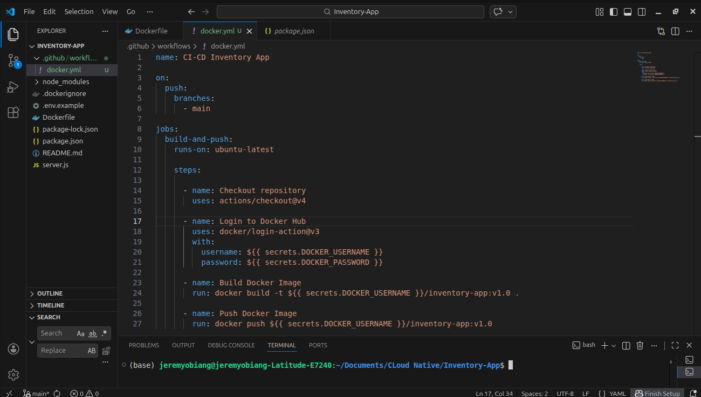

## Fonctionnement du pipeline

1. Un développeur pousse du code sur le dépôt GitHub.
2. Le workflow GitHub Actions se déclenche automatiquement.
3. Le pipeline se connecte à Docker Hub via des secrets GitHub.
4. L’image Docker est construite.
5. L’image est taguée (`v1.0`).
6. L’image est poussée vers Docker Hub.

## Secrets GitHub utilisés

| Secret          | Description                      |
| --------------- | -------------------------------- |
| DOCKER_USERNAME | Nom d’utilisateur Docker Hub     |
| DOCKER_PASSWORD | mot de passe Docker Hub          |

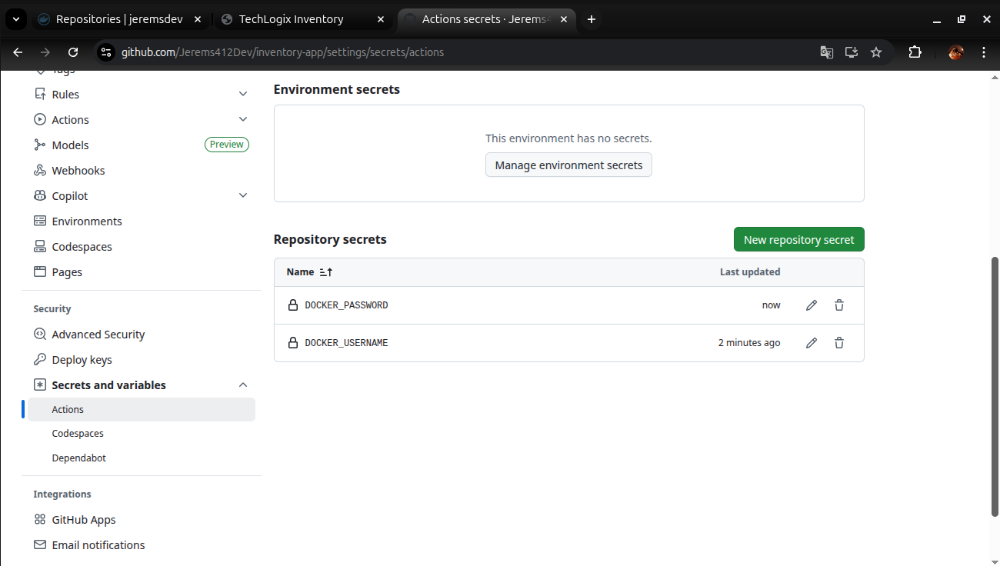

Commande de build utilisée dans le pipeline :

```bash
docker build -t jeremsdev/inventory-app:v1.0 .
```

Commande de push :

```bash
docker push jeremsdev/inventory-app:v1.0
```

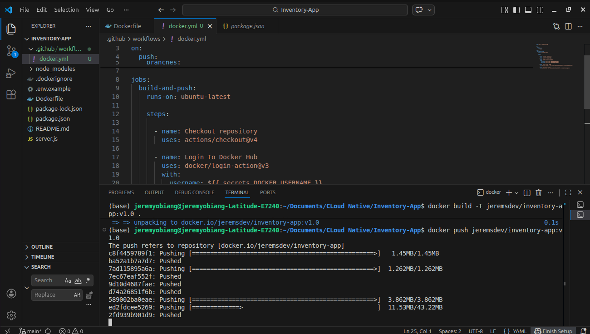
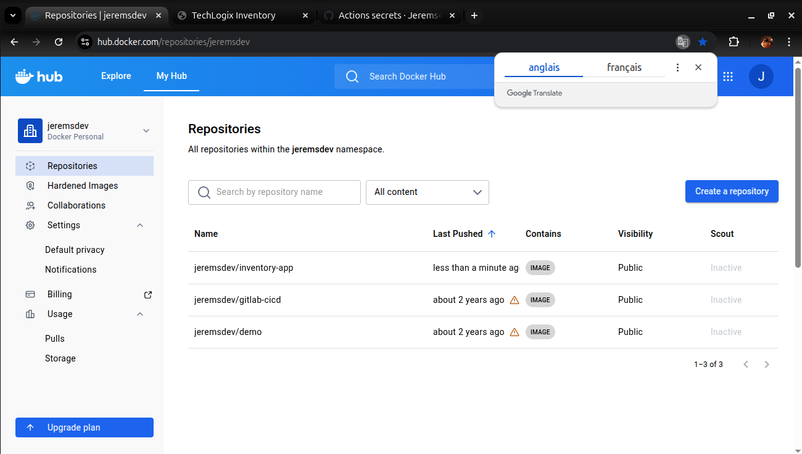
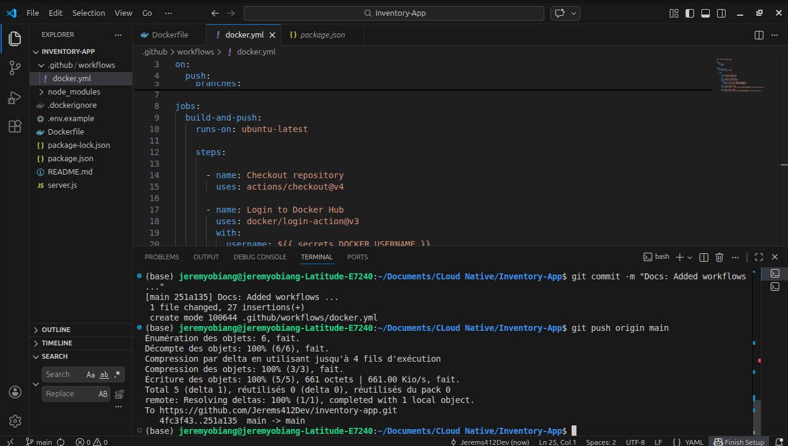
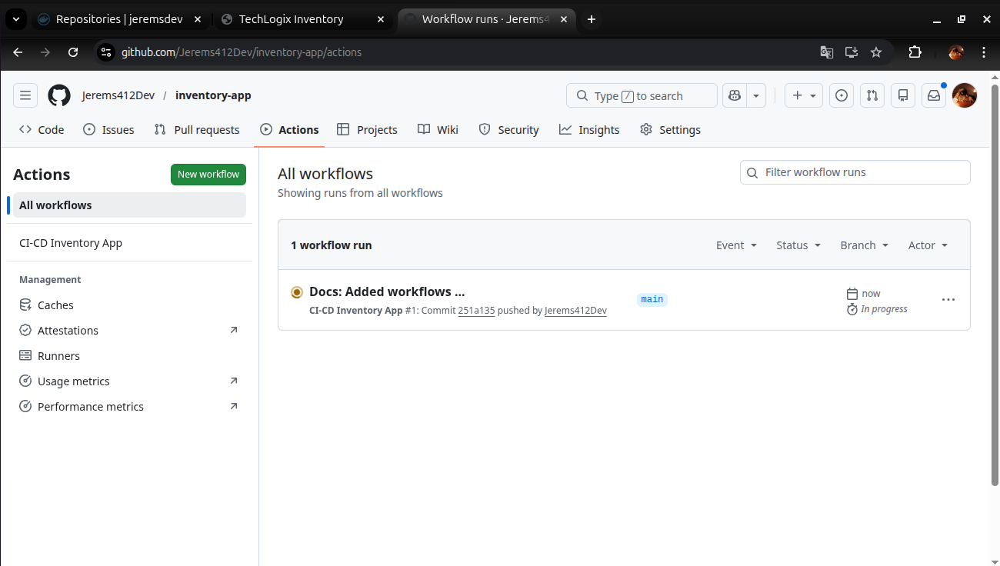
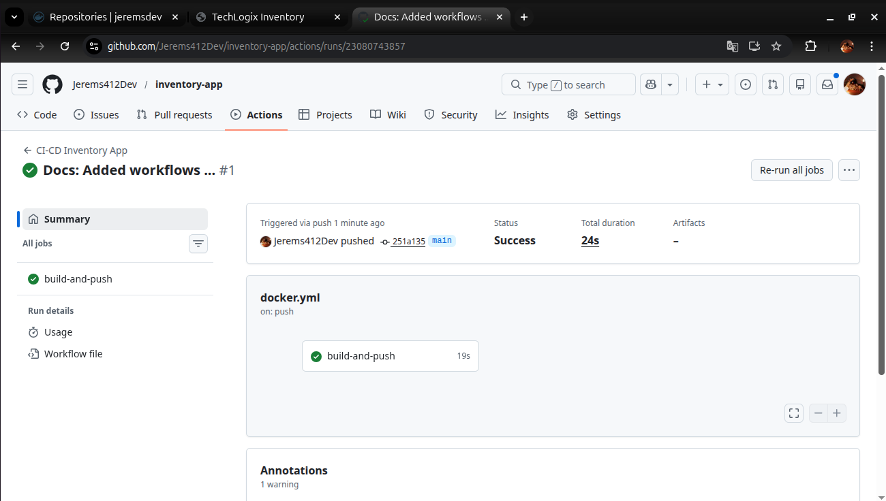
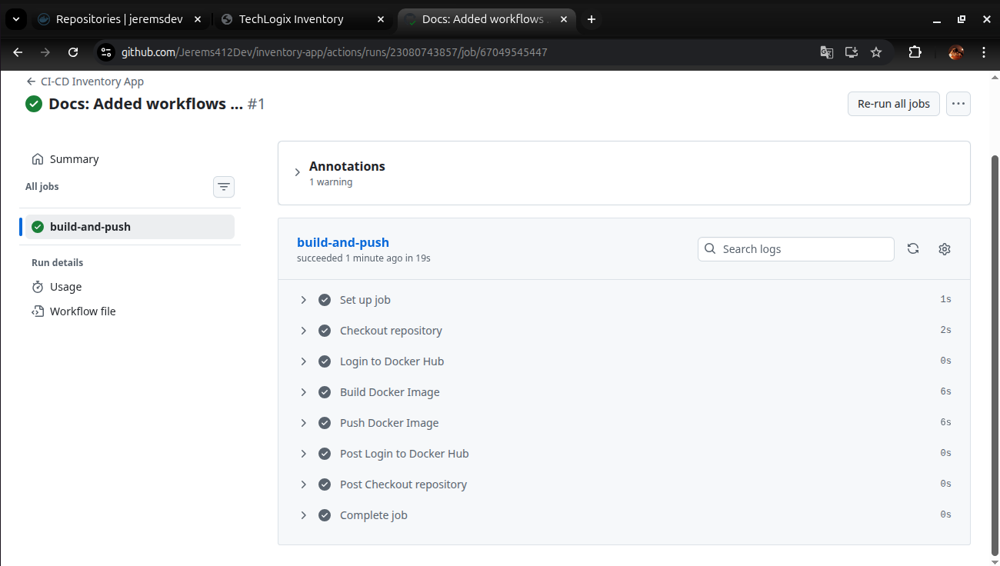
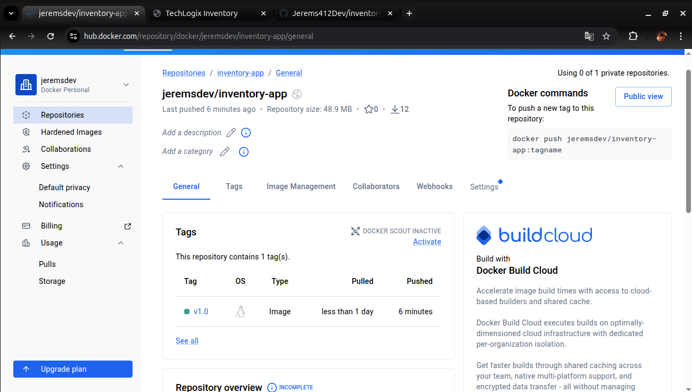


---

# Déploiement sur Kubernetes

L’application est déployée sur un cluster Kubernetes à l’aide de deux fichiers manifestes :

* `deployment.yaml`
* `service.yaml`

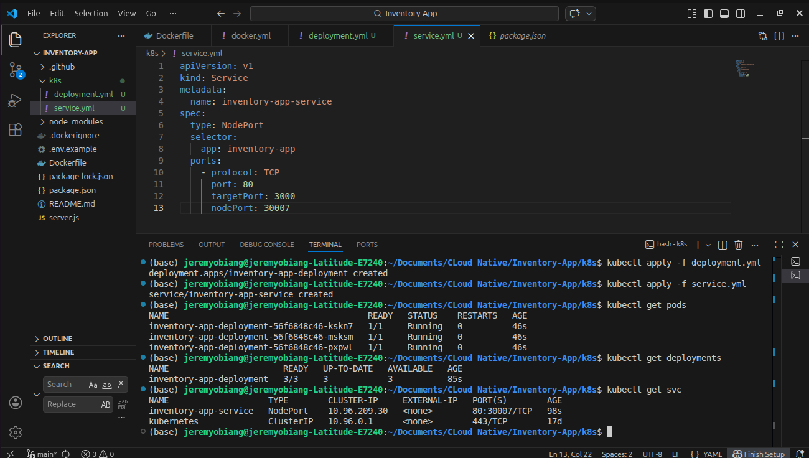

## Deployment

Le deployment crée **3 réplicas** de l’application afin d’assurer la haute disponibilité.

```yaml
replicas: 3
```

L’image utilisée dans le déploiement est celle publiée sur Docker Hub :

```
image: jeremsdev/inventory-app:v1.0
```

---

# Commandes Kubernetes utilisées

## Déployer l’application

```bash
kubectl apply -f deployment.yaml
kubectl apply -f service.yaml
```

## Vérifier les deployments

```bash
kubectl get deployments
```

## Vérifier les pods

```bash
kubectl get pods
```

## Vérifier les services

```bash
kubectl get svc
```


## Pour tout verifier en une fois

```bash
kubectl get all
```

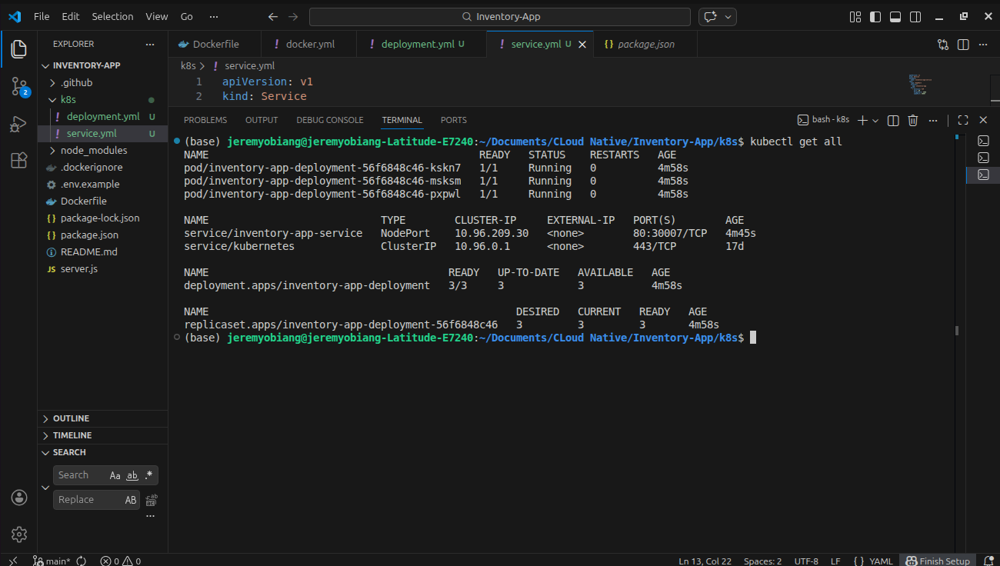

---

# Accéder à l’application sur Kubernetes

Via Minikube :

```bash
minikube service inventory-app-service
```

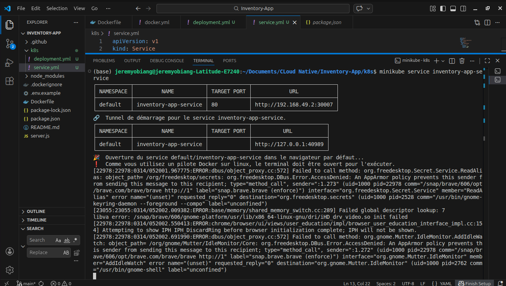

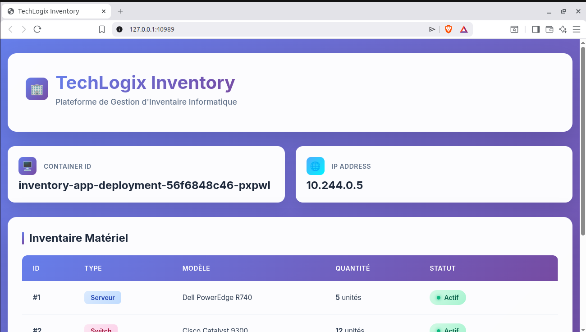

---

# Les Technologies utilisées

* Docker
* GitHub Actions
* Docker Hub
* Kubernetes
* kubectl

---

# Conclusion

Ce projet illustre la mise en place d’une **pipeline CI/CD complète** permettant d’automatiser la conteneurisation, le stockage d’images et le déploiement d’une application sur Kubernetes de manière fiable.
